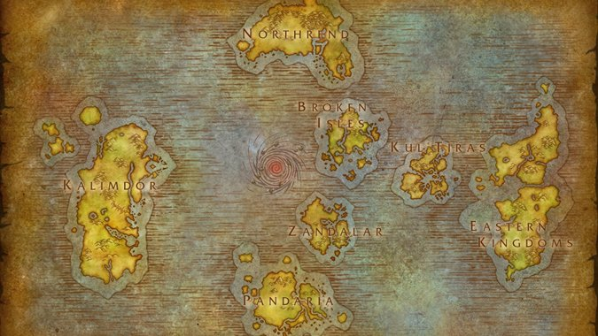

# 魔兽世界地名中英文对照

## Azeroth
| 英文|   中文  |  备注 |
| :-------- | --------:| :------: |
| Azeroth|   艾泽拉斯|  | |

## Eastern Kingdoms
| 英文|   中文  |  备注 |
| :-------- | :--------| :------ |
|Elwynn Forest| 艾尔文森林|    |
|Northshire[^1]| 北郡|  |
|Northshire Abbey|  北郡修道院| |
|Stormwind|暴风城| |
|Stromwind Keep | 暴风要塞| | 
|Cathedral of Light | 光明大教堂|  |
|Valley of Heroes| 英雄谷|  |
|Goldshire| 闪金郡 | |
|Goldshire Inn | 闪金旅馆|
|Dead Mines| 死亡矿井|  |
|Red Ridge Mountains | 赤脊山脉| |
| Duskwood|  暮色森林|  | |
|Darkshire|夜色镇|据[考证](https://bbs.nga.cn/read.php?tid=1974669&rand=987)说夜色镇前身是格兰村(Grand Hamlet)|
|Deadwind Pass|逆风小径| |

[^1]: sheriff（治安官）：国王派驻郡县的长官。在古代中国，最小的政府官员是九品芝麻官——县令。在古代英国，与县令相当的官职是sheriff（郡长）。  这个词在古英语中写作scirgerefa，由scir（=shire，郡）+ gerefa（=reeve，长官）组成，字面意思就是“郡长”（shire reeve）。sheriff由国王任命，代表王室治理一郡，其核心职责是当地的治安和司法，因此sheriff也往往被翻译为“警长”。  
1066年诺曼征服后，说法语的诺曼人将自己county ['kaʊntɪ] n.郡；县的制度带入英国，但英国还是有不少带有-shire的地名。 ​​​​ 
sheriff：['ʃerɪf] n. 州长；郡治安官；执行吏
shire：['ʃaɪə] n.郡
reeve：[riːv] n.城镇长官

## Kalimdor

## Northrend

## Pandaria

## Broken Isles

## Kul Tiras

## Zandalar

## 参考
1. [魔兽世界地名中英文对照 --豆瓣](https://www.douban.com/note/327166810/)
2. [求wow中各地方的中英文对照 --百度](https://zhidao.baidu.com/question/63550672.html)
3. [如何将魔兽世界调成英文版 --NGA](%5B%E6%B1%82wow%E4%B8%AD%E5%90%84%E5%9C%B0%E6%96%B9%E7%9A%84%E4%B8%AD%E8%8B%B1%E6%96%87%E5%AF%B9%E7%85%A7%20--%E7%99%BE%E5%BA%A6%5D%28https://zhidao.baidu.com/question/63550672.html%29)
4. [魔兽世界国服如何改成英文版？--知乎](https://www.zhihu.com/question/49050417)